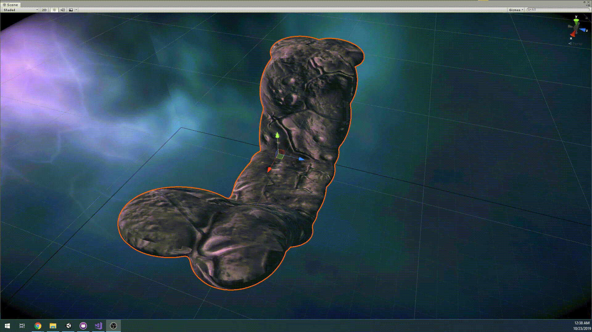

# Unity-Chan-Runner


Unity-Chan Runner is a custom shader project developed as assessment for AIE's Game Programming class Computer Graphics section.
The purpose of the project is to demonstrate the understanding of computer graphics knowlege by creating custom material, shader, mesh optimization and alteration in Unity

## Project Goals

I decided to use this project to as an opportunity improve my previous project [Shakti Unleashed](https://aieseattle.itch.io/shakti-unleashed "Shakti Unleashed itch.io page")

Shakti is a fast-paced flying endless runner developed for AIE's Minor Production (Year 1 Capstone Project).
Our team had came up with the theme where our main character is an diety that was trapped for long time and now have escaped and is running away for freedom but that was not really shown or put into the game due to time constraints.

I wanted to improve that by introducing a mail vilan. Giving the players to a purpose to run away.

This project has three parts 
```
Blackhole
Corrupting Terrains
Mesh Destruction
```

## Blackhole


Blackhole is made with 3 parts
```
Core
Rim
Waves
```

### Core

Core of the blackhole is made by using fresnel effect and passing it to the fragment shader


```
	fixed4 frag (v2f i) : SV_Target
            {
                i.normalDir = normalize(i.normalDir);
                float3 viewDir = normalize(-_WorldSpaceCameraPos.xyz - i.worldPos.xyz);
                float3 normalDirection = i.normalDir;

                float3 emission = (_Color.rgb + ((i.vertex_Color.rgb * pow(pow(1.0 - max(0, dot(normalDirection, viewDir)),         _FresnelValue), _FresnelPower))* _FresnelIntensity));
                float4 col = float4(emission,5);

                UNITY_APPLY_FOG(i.fogCoord, col);
                return col;
            }
```

### Rim


Rim of the blackhole is made with simple additive shader which maps the uv of a texture to render the particles in the shape of the texture

```
            v2f vert (appdata v)
            {
                v2f o;
                o.vertex = UnityObjectToClipPos(v.vertex);
		o.uv = v.uv;
		o.vertexColor = v.vertexColor;
                UNITY_TRANSFER_FOG(o,o.vertex);
                return o;
            }
```

### Waves
Waves use the same custom shader as the rim but a different texture and different particle emmision was used to achieve more stormy like
Also, the core is always rendered on top to acheive the effect of absorbing light


### Post Processing
Final Blackhole with post processing


## Corrupting Terrains

As the blackhole is approaching the character I wanted more visual representation how much the blackhole has caught up instead of looking backwards



### Shader

Corruption effect is made with custom surface shader
The shader takes in 3 different texture. Original, Noise, Corrupted.
It initially renders the original texture and based on the cutoff value it compares the uv of the noise texture and renders the corrupted texture added with corruption color.

Cutoff vaule is changed at runtime by a script that calculates the distand between the terrain and the blackhole

```
void surf (Input IN, inout SurfaceOutputStandard o)
        {
	    half dissolve = tex2D(_NoiseTex, IN.uv_MainTex).r;

            // Albedo comes from a texture tinted by color
            fixed4 c = tex2D (_MainTex, IN.uv_MainTex) * _Color;
            o.Albedo = c.rgb;

            // Metallic and smoothness come from slider variables
            o.Metallic = _Metallic;
	    o.Smoothness = .3;
            o.Alpha = c.a;
	    o.Normal = UnpackNormal(tex2D(_NormalMap, IN.uv_MainTex));

	    fixed4 d = tex2D(_ColorTex, IN.uv_MainTex) * _CorruptionColor;
	    o.Emission = d.rgb * step(dissolve - _Cutoff, 0.05f); //emits white color with 0.05 border size

			
            if (dissolve <= _Cutoff) {
		fixed4 c = tex2D(_ColorTex, IN.uv_MainTex) * _CorruptionColor;
		o.Albedo = c.rgb + o.Emission;
		//discard;
	   }
        }
```

## Mesh Destruction 


I wante to simulate the effect of blackhole sucking everything that is near by. In order to acheive that effect I destroyed into little pieces by using the vertices data of the original mesh then adding explosion force to spread them out farther then let the blackhole start attracting them

### Destruction Optimization

The original approach worked well with 1 mesh but as this project is an endless runner multiple meshs were getting destroyed at the same time which cause significant amount of lag.

To solve this issue I had to minimize the number of pieces that I created by using limiting the vertices it reads through then had to scale the pieces to occupy more space so than when the player lookes at the destruction mesh it felt that the same intensity of destruction is happening (but with lower objects created!).
```
for (int submesh = 0; submesh < M.subMeshCount; submesh++)
        {
            int count = 0;
            if (isTurn)
            {
                count = 1024;
            } else
            {
                count = 512;
            }
            int[] indices = M.GetTriangles(submesh);

            for (int i = 0; i < indices.Length; i += count)
            {
                Vector3[] newVerts = new Vector3[3];
                Vector3[] newNormals = new Vector3[3];
                Vector2[] newUvs = new Vector2[3];
                for (int n = 0; n < 3; n++)
                {
                    int index = indices[i + n];
                    newVerts[n] = verts[index];
                    newUvs[n] = uvs[index];
                    newNormals[n] = normals[index];
                }

                Mesh mesh = new Mesh();
                mesh.vertices = newVerts;
                mesh.normals = newNormals;
                mesh.uv = newUvs;

                mesh.triangles = new int[] { 0, 1, 2, 2, 1, 0 };

                GameObject GO = new GameObject("Triangle " + (i / 3));
                GameObject triMesh = new GameObject("Triangle " + (i / 3));

                //GO.layer = LayerMask.NameToLayer("Particle");
                triMesh.layer = LayerMask.NameToLayer("Particle");
                GO.transform.position = transform.position;
                GO.transform.rotation = transform.rotation;
                GO.AddComponent<MeshRenderer>().material = materials[submesh];
                GO.AddComponent<MeshFilter>().mesh = mesh;

                triMesh.AddComponent<BoxCollider>();
                Vector3 center = new Vector3((mesh.vertices[0].x + mesh.vertices[1].x + mesh.vertices[2].x) / 3, (mesh.vertices[0].y + mesh.vertices[1].y + mesh.vertices[2].y) / 3, (mesh.vertices[0].z + mesh.vertices[1].z + mesh.vertices[2].z) / 3);
                triMesh.transform.position = transform.TransformPoint(center);
                GO.transform.parent = triMesh.transform;
                Vector3 explosionPos = new Vector3(transform.position.x + Random.Range(-0.5f, 0.5f), transform.position.y + Random.Range(0f, 0.5f), transform.position.z + Random.Range(-0.5f, 0.5f));
                rb = triMesh.AddComponent<Rigidbody>();
                rb.AddExplosionForce(Random.Range(300, 500), explosionPos, 5);
                rb.useGravity = false;


 
                triMesh.AddComponent<MoveTowardsCenter>();
                triMesh.transform.localScale = new Vector3(3, 3, 3);
                Destroy(triMesh, 2 + Random.Range(0.0f, 1.0f));
                
            }
        }
```
