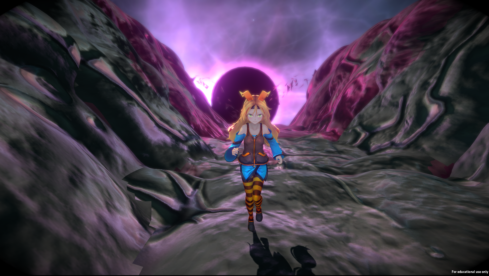
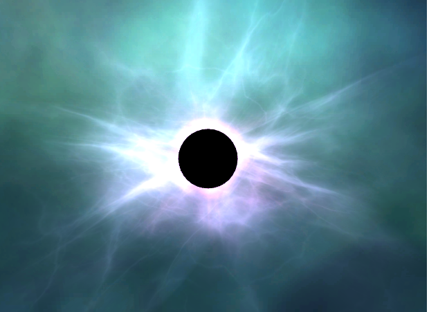
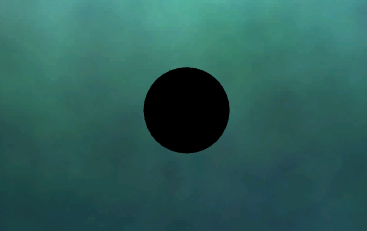
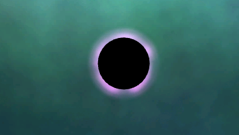
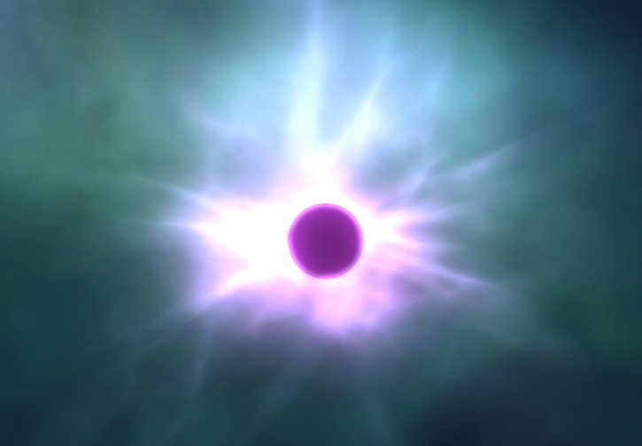

# Project Title



Unity-Chan Runner is a custom shader project developed as assessment for AIE's Game Programming class Computer Graphics section.
The purpose of the project is to demonstrate the understanding of computer graphics knowlege by creating custom material, shader, mesh optimization and alteration in Unity

## Project Goals

I decided to use this project to as an opportunity improve my previous project [Shakti Unleashed](https://aieseattle.itch.io/shakti-unleashed "Shakti Unleashed itch.io page")

Shakti is a fast-paced flying endless runner developed for AIE's Minor Production (Year 1 Capstone Project).
Our team had came up with the theme where our main character is an diety that was trapped for long time and now have escaped and is running away for freedom but that was not really shown or put into the game due to time constraints.

I wanted to improve that by introducing a mail vilan. Giving the players to a purpose to run away.

This project has two parts 
```
1. Blackhole
2. Corrupting terrains
```

## Blackhole


Blackhole is made with 3 parts
```
Core
Rim
Waves
```

### Core

Core of the blackhole is made by using fresnel effect and passing it to the fragment shader



```
fixed4 frag (v2f i) : SV_Target
            {
                i.normalDir = normalize(i.normalDir);
                float3 viewDir = normalize(-_WorldSpaceCameraPos.xyz - i.worldPos.xyz);
                float3 normalDirection = i.normalDir;

                float3 emission = (_Color.rgb + ((i.vertex_Color.rgb * pow(pow(1.0 - max(0, dot(normalDirection, viewDir)),         _FresnelValue), _FresnelPower))* _FresnelIntensity));
                float4 col = float4(emission,5);

                UNITY_APPLY_FOG(i.fogCoord, col);
                return col;
            }
```

### Rim


Rim of the blackhole is made with simple additive shader which maps the uv of a texture to render the particles in the shape of the texture

```
            v2f vert (appdata v)
            {
                v2f o;
                o.vertex = UnityObjectToClipPos(v.vertex);
				        o.uv = v.uv;
				        o.vertexColor = v.vertexColor;
                UNITY_TRANSFER_FOG(o,o.vertex);
                return o;
            }
```

### Waves
Waves use the same custom shader as the rim but a different texture and different particle emmision was used to achieve more stormy like


### Post Processing
Final Blackhole with post processing


## Corrupting Terrains

Add additional notes about how to deploy this on a live system


